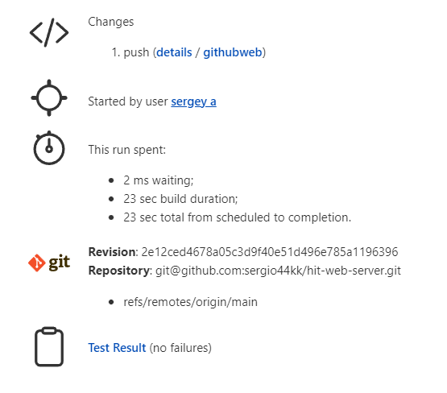
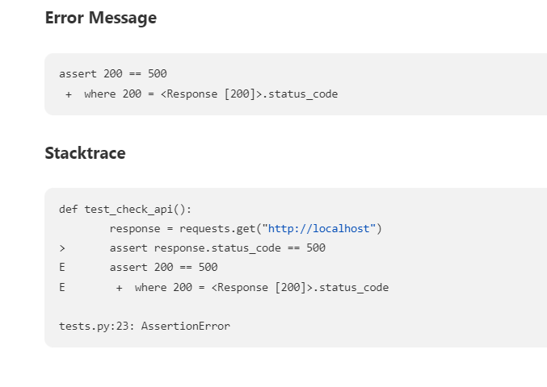
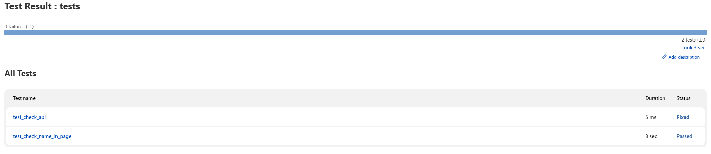
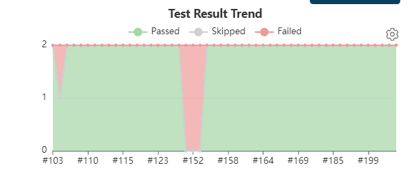

student: Sergey Artemieve
ID: 320689789
course : DevOps

In this project we have 2 folders
automation - which is for the qa automation tests
webserver- where is the server and the docker file are

the jenkins file is in the git and not in the jenkins.
because we want it to be backed up with all the necessary files

we step up our jenkins to check every minute with the PCM option to see if there are any merges to main happened
if no nothing happens
if yes we will go through our stages:

stage Build
    will build the new docker from the dockerfile

stage Push
    will push it to docker hub

stage Deploy QA
    will run the docker with the name application-qa on port 80 with the job name and the build number
    example: 
        sergio44kk/hit-web-server-main:86

stage AUTOMATION TESTS
    we have our chrome driver in the automation folder as well so we can easy use it
    in this stage we will run our tests
    I used pytest
    First of all we will install our pacakges : selenium, pytest, requests
    then we run the tests and generate a juit report with the results(will be shown later)
    we have 2 tests:
        1.with selenium check if my name is in the page
        2.with requests check if the response is 200
    if the tests failed the other stages woun't happen

stage Deploy Prod
    in this stage we have a condition
    ONLY if the merge had a tag 'v' this stage will run
    any other tag we will skip this stage
    if we have the needed tag  will run the docker with the name application-prod on port 8000 with the job name and the build number

test result:
    we can see after the pipeline run we have tests result

all the stages got there own timeout so if the job take more time then expected it will be considered as failuer
cuse we can have an assumption that something went wrong

    

    
if any test fail we can see why: (we can see we expected to get 500 but got 200 so the test failed)

after the fix we can see it :

and in the maine page we have all the previous runs failed and success ration:

